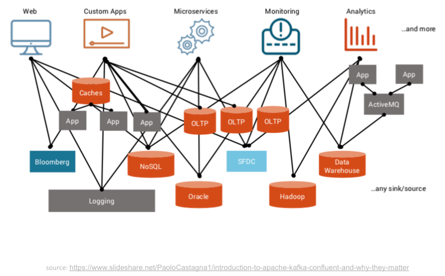
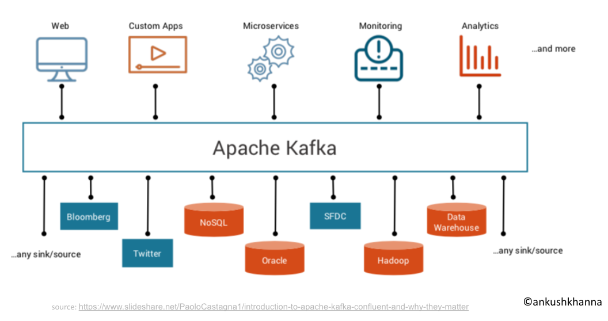

# Introduction to Streaming

# Introduction to Apache Kafka

## What is Kafka?

[Apache Kafka](https://kafka.apache.org/) is a ***message broker*** and ***stream processor***. Kafka is used to handle ***real-time data feeds***.

Kafka is used to upgrade from a project architecture like this...



...to an architecture like this:



In a data project we can differentiate between _consumers_ and _producers_:
* ***Consumers*** are those that consume the data: web pages, micro services, apps, etc.
* ***Producers*** are those who supply the data to consumers.

Connecting consumers to producers directly can lead to an amorphous and hard to maintain architecture in complex projects like the one in the first image. Kafka solves this issue by becoming an intermediary that all other components connect to.

Kafka works by allowing producers to send ***messages*** which are then pushed in real time by Kafka to consumers.

Kafka is hugely popular and most technology-related companies use it.

_You can also check out [this animated comic](https://www.gentlydownthe.stream/) to learn more about Kafka._

## Basic Kafka components

### Message

The basic communication abstraction used by producers and consumers in order to share information in Kafka is called a ***message***.

Messages have 3 main components:
* ***Key***: used to identify the message and for additional Kafka stuff such as partitions (covered later).
* ***Value***: the actual information that producers push and consumers are interested in.
* ***Timestamp***: used for logging.

### Topic

A ***topic*** is an abstraction of a concept. Concepts can be anything that makes sense in the context of the project, such as "sales data", "new members", "clicks on banner", etc.

A producer pushes a message to a topic, which is then consumed by a consumer subscribed to that topic.

### Broker and Cluster

A ***Kafka broker*** is a machine (physical or virtualized) on which Kafka is running.

A ***Kafka cluster*** is a collection of brokers (nodes) working together.

### Logs

In Kafka, ***logs*** are _data segments_ present on a storage disk. In other words, they're _physical representations of data_.

Logs store messages in an ordered fashion. Kafka assigns a sequence ID in order to each new message and then stores it in logs.

### Intermission: visualizing the concepts so far

Here's how a producer and a consumer would talk to the same Kafka broker to send and receive messages.

* Producer sending messages to Kafka.
    ```mermaid
    flowchart LR
        p(producer)
        k{{kafka broker}}
        subgraph logs[logs for topic 'abc']
            m1[message 1]
            m2[message 2]
            m3[message 3]
        end
        p-->|1. Declare topic 'abc'|k
        p-->|2. Send messages 1,2,3|k
        k -->|3. Write messages 1,2,3|logs
        k-.->|4. ack|p
    ```
    1. The producer first declares the topic it wants to "talk about" to Kafka. In this example, the topic will be `abc`. Kafka will then assign a _physical location_ on the hard drive for that specific topic (the topic logs).
    1. The producer then sends messages to Kafka (in our example, messages 1, 2 and 3).
    1. Kafka assigns an ID to the messages and writes them to the logs.
    1. Kafka sends an acknowledgement to the producer, informing it that the messages were successfully sent and written.

* Consumer receiving messages
    * Broker and logs are the same as those in the first graph; the graph has been split in 2 for clarity.
    ```mermaid
    flowchart LR
        c(consumer)
        k{{kafka broker}}
        subgraph logs[logs for topic 'abc']
            m1[message 1]
            m2[message 2]
            m3[message 3]
        end
        c-->|1. Subscribe to topic 'abc|k
        k<-->|2. Check messages|logs
        k-->|3. Send unread messages|c
        c-.->|4. ack|k
    ```
    1. The consumer declares to Kafka that it wants to read from a particular topic. In our example, the topic is `abc`.
    1. Kafka checks the logs and figures out which messages for that topic have been read and which ones are unread.
    1. Kafka sends the unread messages to the consumer.
    1. The consumer sends an acknowledgement to Kafka, informint it that the messages were successfully received.

### `__consumer_offsets`

The workflows work fine for a single consumer but it omits how it keeps track of read messages. It also doesn't show what would happen if 2 or more consumers are consuming messages for the same topic.

***`__consumer_offsets`*** is a special topic that keeps track of messages read by each consumer and topic. In other words: _Kafka uses itself_ to keep track of what consumers do.

When a consumer reads messages and Kafka receives the ack, Kafka posts a message to `__consumer_offsets` with the consumer ID, the topic and the message IDs that the consumer has read. If the consumer dies and spawns again, Kafka will know the last message delivered to it in order to resume sending new ones. If multiple consumers are present, Kafka knows which consumers have read which messages, so a message that has been read by consumer #1 but not by #2 can still be sent to #2.

### Consumer Groups

A ***consumer group*** is composed of multiple consumers.

In regards of controlling read messages, Kafka treats all the consumers inside a consumer group as a _single entity_: when a consumer inside a group reads a message, that message will ***NOT*** be delivered to any other consumer in the group.

Consumer groups allow consumer apps to scale independently: a consumer app made of multiple consumer nodes will not have to deal with duplicated or redundant messages.

Consumer groups have IDs and all consumers within a group have IDs as well.

The default value for consumer groups is 1. All consumers belong to a consumer group.

### Partitions

>Note: do not confuse BigQuery or Spark partitions with Kafka partitions; they are different concepts.

Topic logs in Kafka can be ***partitioned***. A topic is essentially a _wrapper_ around at least 1 partition.

Partitions are assigned to consumers inside consumer groups:
* ***A partition*** is assigned to ***one consumer only***.
* ***One consumer*** may have ***multiple partitions*** assigned to it.
* If a consumer dies, the partition is reassigned to another consumer.
* Ideally there should be as many partitions as consumers in the consumer group.
    * If there are more partitions than consumers, some consumers will receive messages from multiple partitions.
    * If there are more consumers than partitions, the extra consumers will be idle with nothing to do.

Partitions in Kafka, along with consumer groups, are a scalability feature. Increasing the amount of partitions allows the consumer group to increase the amount of consumers in order to read messages at a faster rate. Partitions for one topic may be stored in separate Kafka brokers in our cluster as well.

Messages are assigned to partitions inside a topic by means of their ***key***: message keys are hashed and the hashes are then divided by the amount of partitions for that topic; the remainder of the division is determined to assign it to its partition. In other words: _hash modulo partition amount_.
* While it would be possible to store messages in different partitions in a round-robin way, this method would not keep track of the _message order_.
* Using keys for assigning messages to partitions has the risk of making some partitions bigger than others. For example, if the topic `client` makes use of client IDs as message keys and one client is much more active than the others, then the partition assigned to that client will grow more than the others. In practice however this is not an issue and the advantages outweight the cons.

### Replication

Partitions are ***replicated*** accross multiple brokers in the Kafka cluster as a fault tolerance precaution.

When a partition is replicated accross multiple brokers, one of the brokers becomes the ***leader*** for that specific partition. The leader handles the message and writes it to its partition log. The partition log is then replicated to other brokers, which contain ***replicas*** for that partition. Replica partitions should contain the same messages as leader partitions.

If a broker which contains a leader partition dies, another broker becomes the leader and picks up where the dead broker left off, thus guaranteeing that both producers and consumers can keep posting and reading messages.

We can define the _replication factor_ of partitions at topic level. A replication factor of 1 (no replicas) is undesirable, because if the leader broker dies, then the partition becomes unavailable to the whole system, which could be catastrophic in certain applications.

## Avro and Schema Registry
## Kafka Connect
## Kafka Streams
## What questions to ask?

